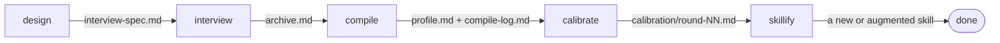

# Metacognition

A plugin for Claude that captures how you judge work in a field you practice.
It interviews you, one question or one short battery at a time, compresses the answers into a short profile, tests the profile against real tasks, and turns it into a skill.
It is for anyone who wants their taste written down in a form Claude can apply, in any field.

<!-- --8<-- [start:beta] -->
This plugin is in beta at version 0.2.0.
Expect rough edges: commands, file formats, and behavior may change between versions.
The source, releases, and issue tracker are at [MasonEgger/metacognition-plugin](https://github.com/MasonEgger/metacognition-plugin) on GitHub.
<!-- --8<-- [end:beta] -->

## The Five Stages



| Command | What it does |
|---|---|
| `/metacognition:design` | Scopes an extraction for a domain and writes `interview-spec.md`, greenfield or augmenting an existing skill |
| `/metacognition:interview` | Runs the designed interview, one question or one short battery per turn, and writes the answers to `archive.md` |
| `/metacognition:compile` | Compresses the archive into `profile.md` and logs every cut to `compile-log.md` |
| `/metacognition:calibrate` | Runs a probe task against the profile, takes your redlines, and folds each correction back in |
| `/metacognition:skillify` | Turns the calibrated profile into a new skill, or into a diff against an existing skill that you approve |

Files land under `./extractions/<slug>/` unless you configure another root.
No stage starts the next one.
Each is run on its own, from any directory, and can be re-run from its own inputs.

## Install

<!-- --8<-- [start:install] -->
On Claude Code, add the marketplace, then install the plugin:

```bash
claude plugin marketplace add MasonEgger/metacognition-plugin
claude plugin install metacognition@metacognition-plugin
```

The marketplace is named `metacognition-plugin` and the plugin is named `metacognition`.

On claude.ai and Cowork, the marketplace is the primary path: add the marketplace from <https://github.com/MasonEgger/metacognition-plugin> and install the `metacognition` plugin from it.

The alternate path is the release zip.
Download `metacognition-<version>.zip` from the Releases page of <https://github.com/MasonEgger/metacognition-plugin> and upload it through Customize, Plugins.

The `plugin-dev` plugin is a highly recommended companion install.
Skillify uses it to check a skill's structure against the provider's skill-craft guidance.
Nothing requires it: without it, skillify says so and continues on its own templates.
<!-- --8<-- [end:install] -->

## Docs

The docs site is at <https://masonegger.github.io/metacognition-plugin/>.

## Model

Use the most capable model available.

<!-- --8<-- [start:credit] -->
[Inspired by Ruben Hassid's blog](https://ruben.substack.com/p/youre-just-a-text-file)
<!-- --8<-- [end:credit] -->

## License

MIT. See [LICENSE](LICENSE).
