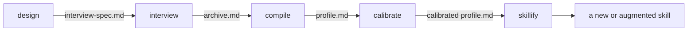

# Metacognition

!!! warning "Beta"

    --8<-- "README.md:beta"

Metacognition is a plugin for Claude that captures how a person judges work in a field they practice and turns that judgment into a skill Claude can apply.

You answer questions about your own taste, one question or one short set of related questions at a time.
The plugin keeps your answers word for word, compresses them into a short profile, tests that profile against real work, and packages the result as a skill.

## Who It Is For

Everyone.
It is not specific to an industry.
Anyone who wants to dig into why they hold the preferences they hold in their field, and write those preferences down so they can be used, can run it.
"The person" throughout this site means whoever's taste is being captured, which is you.

## The Pipeline

The plugin is five stages, each its own skill.
You run each one yourself, and no stage starts the next.
Any stage can be re-run from its own inputs.

| Stage | Writes | What happens |
|---|---|---|
| [Design](stages/design.md) | `interview-spec.md` | Plans the interview. Never asks a taste question. |
| [Interview](stages/interview.md) | `archive.md` | Asks one question, or one short battery, per turn. Keeps answers verbatim. |
| [Compile](stages/compile.md) | `profile.md` | Compresses the archive and logs every cut. |
| [Calibrate](stages/calibrate.md) | `calibration/round-NN.md` | Tests the profile on a probe task and folds your corrections back. |
| [Skillify](stages/skillify.md) | a new or augmented skill | Packages the calibrated profile. |

## Where It Runs

The plugin runs on Claude Code, Cowork, and claude.ai chat.
[Getting Started](getting-started.md) covers installation on each.

## Where to Read Next

- [Getting Started](getting-started.md) installs the plugin and explains the three surfaces.
- [The Five Stages](stages/index.md) has one page per stage.
- [The Method](method.md) is the reasoning behind the interview.
- [Privacy](privacy.md) covers what the files contain and where they should not go.

!!! note "Credit"

    --8<-- "README.md:credit"
